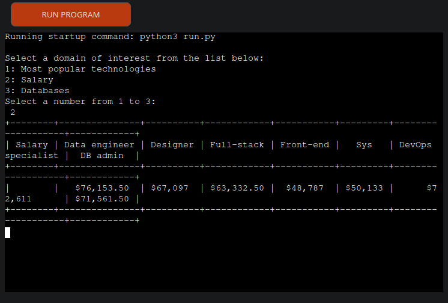

# IT Survey

For the third project with **Code Institute** I created a Survey using the Python programming language.

**[View the live project](https://it-survey-e48322bf5006.herokuapp.com)**

**[The repository is here](https://github.com/NaMlex/IT-Survey)**

**[Google sheet link](https://docs.google.com/spreadsheets/d/1MUYjwg7MoEk077Yy2XX3dZg1tD1eYB0As4yU-SGhbCY/edit?gid=0#gid=0)**

## Description
IT-Survey is an app that shows information about the IT industry.

### How it works
Users have a choice between 3 options to obtain the desired information.

**Each option has its own result**

For most populat technologies: 

For Salary:

For Databases:

## Scope
**What users may expect:**

- A simple way to obtain information about the IT industry
- Most popular technologies
- Salary in the field of IT
- Databases

## Tools used

- [Am I responsive](http://ami.responsivedesign.is/#): Was used to simulate how the game looks at different screen sizes.

- [GitHub](https://github.com/) : Was used as the repository for the project's code.

- [Python](https://www.python.org/) : Programming language was used to create the CLI.

- [Gspread](https://docs.gspread.org/en/latest/) : Python API for Google Sheets.

- [Outh2](https://developers.google.com/identity/protocols/oauth2) : Protocol to access Google APIs

- [PrettyTable](https://pypi.org/project/prettytable/) : Is simple Python library for easily displaying tabular data in a visually appealing ASCII table format

- [Heroku](https://www.heroku.com/) : Heroku is a cloud platform as a service supporting several programming languages. 

## Credits

 Mentor support, guidance, and tips to improve my coding skills throughout the project:
**Brian Macharia**
